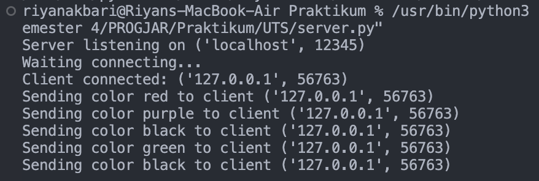
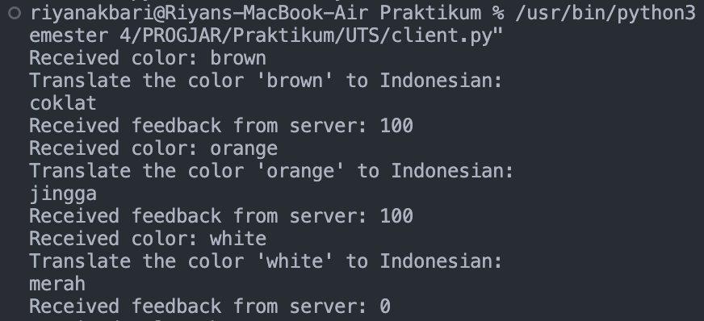
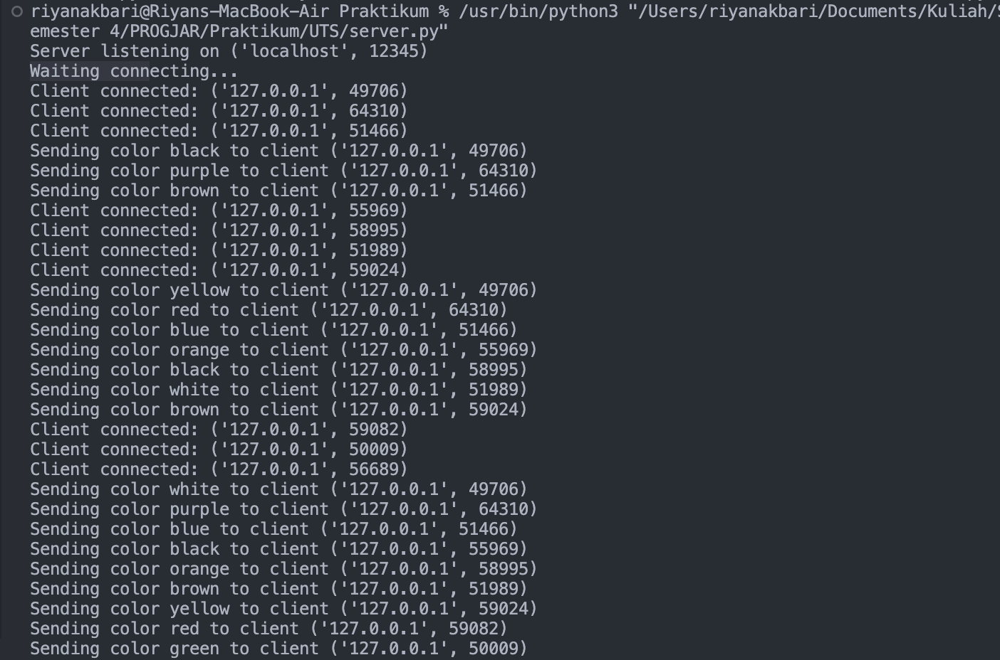
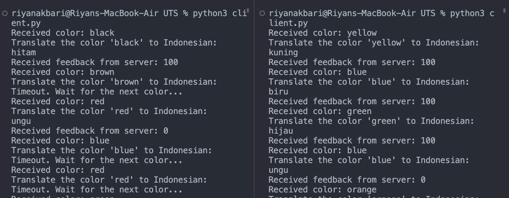

# Ujian Tengah Semester - Permainan Kata Warna Menggunakan UDP Socket

## Nama  : M. Riyan Akbari - NIM : 1203220131

## Soal

Buatlah sebuah permainan yang menggunakan soket dan protokol UDP. Permainannya cukup sederhana, dengan 1 server dapat melayani banyak klien (one-to-many). Setiap 10 detik, server akan mengirimkan kata warna acak dalam bahasa Inggris kepada semua klien yang terhubung. Setiap klien harus menerima kata yang berbeda (unik). Selanjutnya, klien memiliki waktu 5 detik untuk merespons dengan kata warna dalam bahasa Indonesia. Setelah itu, server akan memberikan nilai feedback 0 jika jawabannya salah dan 100 jika benar.

## Jawaban

**server.py**

```py
import socket
import random
import time
import threading

# Daftar kata warna dalam bahasa Inggris dan Indonesia
color_map = {
    "red": "merah",
    "green": "hijau",
    "blue": "biru",
    "yellow": "kuning",
    "orange": "jingga",
    "purple": "ungu",
    "brown": "coklat",
    "black": "hitam",
    "white": "putih"
}

# Inisialisasi socket UDP
server_socket = socket.socket(socket.AF_INET, socket.SOCK_DGRAM)

# Bind ke alamat dan port tertentu
server_address = ('localhost', 12345)
server_socket.bind(server_address)

print("Server listening on {}".format(server_address))
print("Waiting connecting...")

# Menyimpan status warna yang dikirim ke setiap klien
clients_colors = {}

def send_color():
    while True:
        # Membuat salinan acak dari daftar kata warna
        colors = list(color_map.keys()).copy()
        random.shuffle(colors)

        for client_address in clients_colors.keys():
            # Mengirim kata warna acak ke setiap klien
            color_eng = colors.pop()
            clients_colors[client_address] = color_eng
            message = "Color: " + color_eng
            server_socket.sendto(message.encode(), client_address)
            print("Sending color {} to client {}".format(color_eng, client_address))

        time.sleep(10)

def receive_response():
    while True:
        # Menerima jawaban dari klien
        data, address = server_socket.recvfrom(1024)
        answer = data.decode().lower()

        if answer == "connect":
            clients_colors[address] = None
            clients.add(address)
            print("Client connected:", address)
            continue

        # Memberikan feedback
        if answer in color_map.values():
            correct_color = clients_colors[address]
            if correct_color is not None and color_map[correct_color] == answer:
                feedback = "100"
            else:
                feedback = "0"

        server_socket.sendto(feedback.encode(), address)

# Menyimpan daftar klien yang terhubung
clients = set()

# Memulai thread untuk mengirim warna
thread_send = threading.Thread(target=send_color)
thread_send.start()

# Memulai thread untuk menerima jawaban
thread_receive = threading.Thread(target=receive_response)
thread_receive.start()
```

**client.py**

```py
import socket
import threading
import sys
import select

# Inisialisasi socket UDP
client_socket = socket.socket(socket.AF_INET, socket.SOCK_DGRAM)

# Alamat server
server_address = ('localhost', 12345)

# Terhubung ke server
client_socket.sendto("connect".encode(), server_address)

def receive_and_send():
    while True:
        # Menerima pesan dari server
        data, _ = client_socket.recvfrom(1024)
        color_eng = data.decode().split(": ")[1]

        # Meminta input warna dalam bahasa Indonesia dari pengguna
        print("Received color:", color_eng)
        color_translation = get_input_with_timeout("Translate the color '{}' to Indonesian: ".format(color_eng), 5)

        if color_translation is None:
            print("Timeout. Wait for the next color...")
            continue

        # Kirim jawaban ke server
        client_socket.sendto(color_translation.encode(), server_address)

        # Menerima feedback dari server
        feedback, _ = client_socket.recvfrom(1024)
        print("Received feedback from server:", feedback.decode())

def get_input_with_timeout(prompt, timeout_seconds):
    print(prompt)
    inputs, _, _ = select.select([sys.stdin], [], [], timeout_seconds)
    if inputs:
        return sys.stdin.readline().strip()
    else:
        return None

# Memulai thread untuk menerima dan mengirim pesan
thread_receive = threading.Thread(target=receive_and_send)
thread_receive.start()
```
<br>

## Penjelasan

### Server
Program server diatas merupakan program yang mengimplementasikan permainan sederhana menggunakan protokol UDP dan multithreading. Dimana server dapat mengirimkan kata warna acak dalam bahasa inggris setiap 10 detik kepada semua client yang terhubung. Kemudian server akan memberikan feedback berupa nilai 100 jika client mengirimkan kata warna yang benar dalam bahasa indonesia dan akan mengirimkan feedback nilai 0 jika salah.

**Import Library**
```py
import socket
import random
import time
import threading
```
Kita mengimport semua library yang akan kita gunakan untuk membuat socket, mengacak kata warna, mengatur waktu dan menggunakan threading.

**Daftar Kata Warna**
```py
color_map = {
    "red": "merah",
    "green": "hijau",
    "blue": "biru",
    "yellow": "kuning",
    "orange": "jingga",
    "purple": "ungu",
    "brown": "coklat",
    "black": "hitam",
    "white": "putih"
}
```
Membuat daftar kata warna dalam bahasa inggris dan bahasa indonesia untuk digunakan dalam permainan.

**Inisialisasi Socket UDP**
```py
server_socket = socket.socket(socket.AF_INET, socket.SOCK_DGRAM)
```
Kemudian kita membuat objek socket UDP untuk server.

**Bind ke Alamat dan Port**
```py
server_address = ('localhost', 12345)
server_socket.bind(server_address)
```
Selanjutnya, kita akan mengikat socket ke alamat dan port tertentu.

**Status Warna**
```py
clients_colors = {}
```
clients_colors digunakan untuk menyimpan status warna yang dikirim ke setiap client.

**Mengirim Warna**
```py
def send_color():
    while True:
        # Membuat salinan acak dari daftar kata warna
        colors = list(color_map.keys()).copy()
        random.shuffle(colors)

        for client_address in clients_colors.keys():
            # Mengirim kata warna acak ke setiap klien
            color_eng = colors.pop()
            clients_colors[client_address] = color_eng
            message = "Color: " + color_eng
            server_socket.sendto(message.encode(), client_address)
            print("Sending color {} to client {}".format(color_eng, client_address))

        time.sleep(10)
```
Kemudian kita memiliki thread untuk mengirimkan kata warna acak ke semua client yang terhubung setiap 10 detik.

**Menerima Jawaban**
```py
def receive_response():
    while True:
        # Menerima jawaban dari klien
        data, address = server_socket.recvfrom(1024)
        answer = data.decode().lower()

        if answer == "connect":
            clients_colors[address] = None
            clients.add(address)
            print("Client connected:", address)
            continue

        # Memberikan feedback
        if answer in color_map.values():
            correct_color = clients_colors[address]
            if correct_color is not None and color_map[correct_color] == answer:
                feedback = "100"
            else:
                feedback = "0"

        server_socket.sendto(feedback.encode(), address)
```
Selanjutnya, kita memiliki thread untuk menerima jawaban dari client dan mengirimkan feedback berupa skor ke client.

**Daftar Client**
```py
clients = set()
```
clients digunakan untuk menyimpan daftar client yang terhubung ke server.

**Memulai Thread**
```py
thread_send = threading.Thread(target=send_color)
thread_send.start()

thread_receive = threading.Thread(target=receive_response)
thread_receive.start()
```
Terakhir kita akan memulai thread untuk mengirim warna dan menerima jawaban dari klien secara bersamaan.

<br>

### Client
Program client diatas merupakan program yang mengimplementasikan permainan sederhana menggunakan protokol UDP dan multithreading. Dimana client dapat menerima kata warna acak dalam bahasa inggris setiap 10 detik dari server. Kemudian client memiliki waktu 5 detik untuk menjawabnya. Jika benar, client akan mendapatkan balasan feedback berupa nilai 100, jika salah maka akan mendapatkan nilai 0.

**Import Library**
```py
import socket
import threading
import sys
import select
```
Kita mengimport semua library yang akan kita gunakan untuk membuat socket, menggunakan threading, dan mengatur input/output.

**Inisialisasi Socket UDP**
```py
client_socket = socket.socket(socket.AF_INET, socket.SOCK_DGRAM)
```

Kemudian kita membuat objek socket UDP untuk client.

**Alamat Server**
```py
server_address = ('localhost', 12345)
```
Kemudian menentukan alamat dan port server yang akan dihubungkan.

**Permintaan Koneksi**
```py
client_socket.sendto("connect".encode(), server_address)
```
Selanjutnya client mengirim permintaan koneksi ke server.

**Menerima dan Mengirim Pesan**
```py
def receive_and_send():
    while True:
        data, _ = client_socket.recvfrom(1024)
        color_eng = data.decode().split(": ")[1]

        print("Received color:", color_eng)
        color_translation = get_input_with_timeout("Translate the color '{}' to Indonesian: ".format(color_eng), 5)

        if color_translation is None:
            print("Timeout. Wait for the next color...")
            continue

        client_socket.sendto(color_translation.encode(), server_address)

        feedback, _ = client_socket.recvfrom(1024)
        print("Received feedback from server:", feedback.decode())
```
Kemudian kita memiliki thread untuk menerima pesan dari server, meminta input warna dalam bahasa Indonesia dari pengguna, mengirim jawaban ke server, dan menerima feedback dari server.

**Fungsi get_input_with_timeout**
```py
def get_input_with_timeout(prompt, timeout_seconds):
    print(prompt)
    inputs, _, _ = select.select([sys.stdin], [], [], timeout_seconds)
    if inputs:
        return sys.stdin.readline().strip()
    else:
        return None
```
Kita membuat fungsi untuk meminta input dari pengguna dengan batas waktu tertentu. Jika waktu habis, fungsi akan mengembalikan None.

**Memulai Thread**
```py
thread_receive = threading.Thread(target=receive_and_send)
thread_receive.start()
```
Terakhir kita akan memulai thread untuk menerima dan mengirim pesan secara bersamaan.

<br>

## Contoh dan Cara Penggunaan Program

### Screenshot Contoh

#### Program Server


#### Program Client


### Cara Penggunaan Program

1. Mulai server dengan menjalankan python server.py.
2. Mulai klien dengan menjalankan python client.py.
3. Klien akan menerima kata warna acak dalam bahasa Inggris dan meminta user untuk menerjemahkannya ke dalam bahasa Indonesia.
4. Masukkan kata warna dalam bahasa indonesia dalam waktu 5 detik.
5. Klien akan mendapatkan feedback nilai dari server yang menunjukkan apakah jawaban user benar atau salah.

<br>

## Test Case : 1 Server 10 Client

### Server



Dari ss diatas, bisa kita lihat bahwa server menerima koneksi dari 10 client dan mengirimkan warna random ke seluruh client yang terkoneksi.

### Client



Dari ss diatas, bisa kita lihat bahwa client akan mendapatkan warna random sesuai warna yang dikirimkan oleh server, kemudian jika user menginputkan warna dalam bahasa indonesia yang benar, maka akan mendapatkan feedback nilai 100, jika salah maka akan mendapatkan nilai 0.
