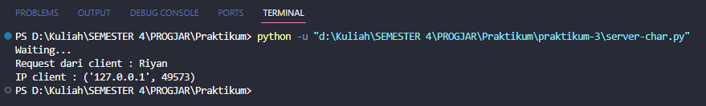

# Tugas 1 - Socket Programming On Python
## Soal & Jawaban

1. Membuat sebuah program server yang dapat menerima koneksi dari klien menggunakan protokol TCP. Server ini akan menerima pesan dari klien dan mengirimkan pesan balasan berisi jumlah karakter pada pesan tersebut. Gunakan port 12345 untuk server. Membuat analisa dari hasil program tersebut 

**Source Code**

```python
import socket

server_socket = socket.socket(socket.AF_INET, socket.SOCK_STREAM)
HOST = 'localhost'
PORT = 12345

server_socket.bind((HOST, PORT))
server_socket.listen(1)
print("Waiting...")

client_socket, client_address = server_socket.accept()
data = client_socket.recv(1024)
jumlahKata = len(data.decode())

print("Request dari client :", data.decode())
print("IP client :", client_address)

response = "Jumlah karakter dalam kalimat tersebut adalah " + str(jumlahKata)

client_socket.sendall(response.encode())
client_socket.close()
server_socket.close()
```

**Output**


**Penjelasan**
Program server menggunakan modul socket di Python untuk menerima pesan dari klien dan mengirimkan pesan balasan berisi jumlah karakter pada pesan tersebut. Program dimulai dengan melakukan import modul socket agar dapat berkomunikasi melalui jaringan, kemudian membuat object socket untuk server menggunakan IPv4 dengan tipe socket SOCK_STREAM yaitu komunikasi menggunakan protokol TCP. Selanjutnya menentukan alamat host dan port yang akan digunakan oleh server yaitu dengan host 127.0.0.1 dan port 12345, lalu mengikat object socket pada server ke alamat dan port yang sudah ditentukan. Selanjutnya server menunggu koneksi masuk dari client server dan menerima koneksi dari client jika berhasil. Kemudian server menerima data yang dikirim dari client lalu menghitung jumlah karakter dalam kalimat yang diterima dari klien setelah didekode. Selanjutnya server mengirim respons ke client setelah mengonversi respons ke byte menggunakan encode. Kemudian menutup koneksi socket client dan server jika sudah selesai. 
